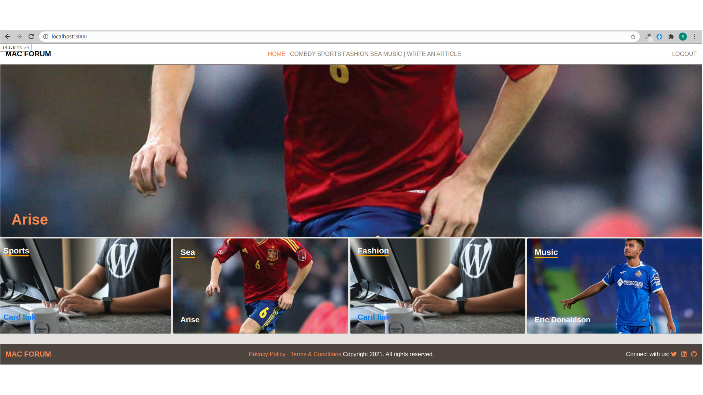

# Mac Forum

> Mac Forum is an online web blog where users can join, create articles and upvote articles. The article with the highest vote gets featured on the from page

This project was mainly built to demonstrate enough understanding of Rails dynamics. The homepage contains the article with the highest vote count; the different categories with each category container featuring the image of their respective recent articles.

Users can create articles and delete articles. Only the admin can create a category. Articles in a category are sorted by the most recent ones.

## Built With

- Ruby on Rails
- SASS, Ruby
- ERB file template, 

## Live Demo

[Live Demo Link](https://livedemo.com)

## Getting Started

### Prerequisites
- Rails
- Yarn
- Postgre DB
- Ruby

### Setup

#### To get a local copy up and running follow these simple example steps.
- In your local PC, open your terminal in the folder you would like to clone the project.
- Clone the repo with the command: `git clone (copied link)`; like so: git clone `https://github.com/TedLivist/mac-forum.git`
- Then run `bundle install` to install all the required dependencies
- Run `rails db:create`, and the `rails db:migrate`
- Run `rails server` to spin up a development server
- Once the server is up, open this link `http://localhost:3000` on your browser

### Run tests
Run `rspec` on the terminal to run the test

## Authors

👤 **Teddy-Livingstone Ememandu**

- [GitHub](https://github.com/TedLivist)
- [Twitter](https://twitter.com/iamxted)
- [LinkedIn](https://linkedin.com/in/tememandu)

## 🤝 Contributing

Contributions, issues, and feature requests are welcome!

Feel free to check the [issues page](issues/).

## Show your support

Give a ⭐️ if you like this project!

## Acknowledgments

- Hat tip to [Nelson Sakwa](https://www.behance.net/sakwadesignstudio) whose design was used. The design can be found [here:](https://www.behance.net/gallery/14554909/liFEsTlye-Mobile-version)
- Inspiration
